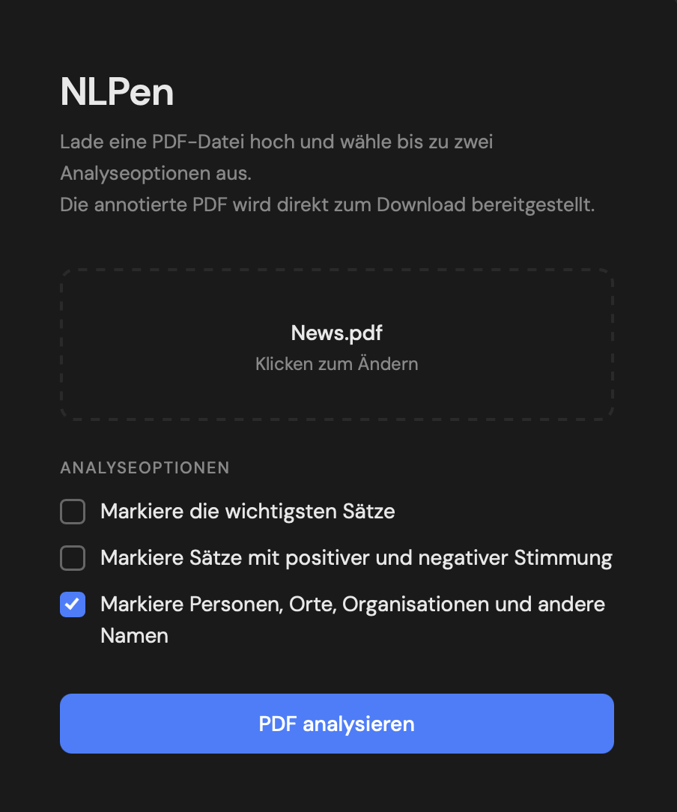
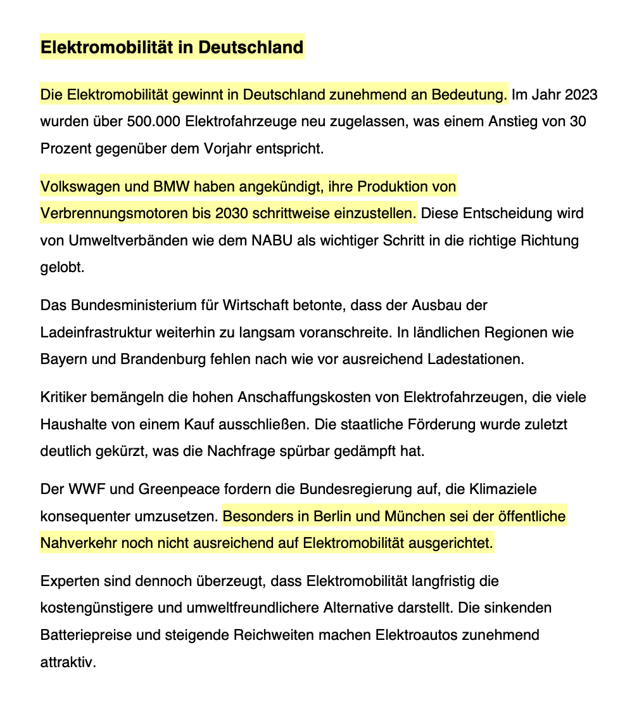

# NLPen — NLP-Based PDF Annotation Tool


[](https://github.com/astral-sh/ruff)
[](https://github.com/ptrick13/NLPen/actions/workflows/ci.yml)
[](https://codecov.io/gh/ptrick13/NLPen)

A web application that runs multiple NLP pipelines on German PDF documents and saves a colour-coded, annotated copy — built as my Bachelor's thesis project and refactored for publication.

---

## What it does

Upload any German-language PDF, select one or two analysis modes, and the app produces an annotated copy with highlights and a colour legend baked into the document.

| Mode | Highlights | Colour |
|------|-----------|--------|
| **Key Sentences** | Most informative sentences (TF-IDF + TextRank) | Yellow |
| **Sentiment** | Positive sentences | Green |
| | Negative sentences | Red |
| **Named Entities** | Persons | Mint green |
| | Organisations | Peach |
| | Locations | Lavender |
| | Miscellaneous names | Light blue |

Any two modes can be combined. When *Key Sentences* and *Sentiment* are combined, only the most important positive/negative sentences are highlighted — filtering noise from both pipelines simultaneously.

---

## Technical approach

### Extractive Summarisation
1. Lemmatise sentences and remove stopwords with **SpaCy** (`de_core_news_md`).
2. Build a TF-IDF matrix with **scikit-learn**.
3. Compute pairwise cosine similarity → weighted graph via **NetworkX**.
4. Run **PageRank** to score each sentence, return the top 20–30 %.

### Sentiment Analysis
- **XLM-RoBERTa** (`cardiffnlp/twitter-xlm-roberta-base-sentiment`) via HuggingFace **Transformers**.
- The multilingual model handles German without language-specific fine-tuning.

### Named Entity Recognition
- **Flair** sequence tagger (`flair/ner-german`) with BIO tagging.
- Classifies four entity types: PER · LOC · ORG · MISC.

---

## Architecture

    NLPen/
    ├── app.py                   # FastAPI web application (REST API + static file serving)
    ├── main.py                  # Entry point — starts the Uvicorn server
    ├── static/
    │   └── index.html           # Single-page web UI
    └── nlpen/
        ├── config.py            # Model names, colours, thresholds — one place to change
        ├── pdf/
        │   ├── extractor.py     # PDF parsing & sentence tokenisation (TextBlobDE)
        │   └── highlighter.py   # Highlight & legend drawing with PyMuPDF
        └── nlp/
            ├── base.py          # Abstract BaseAnalyzer: analyze → annotate → save
            ├── summarizer.py    # SentenceSummarizer  (TF-IDF + TextRank)
            ├── sentiment.py     # SentimentAnalyzer   (XLM-RoBERTa)
            ├── ner.py           # NERAnalyzer         (Flair)
            └── combined.py      # CombinedAnalyzer    (coordinates two modes)

---

## Installation

**Python 3.11 required.**

```bash
# 1. Clone and install dependencies
git clone https://github.com/ptrick13/NLPen.git
cd NLPen
pip install -r requirements.txt

# 2. Download the SpaCy German model
python -m spacy download de_core_news_md
```

> **Note:** Flair (`flair/ner-german`, ~400 MB) and HuggingFace
> (`cardiffnlp/twitter-xlm-roberta-base-sentiment`, ~500 MB) models are
> downloaded automatically on first use.

---

## Usage

```bash
python main.py
```

Then open [http://localhost:8000](http://localhost:8000) in your browser.

1. Drop a German-language PDF onto the upload area (or click to pick a file).
2. Tick one or two analysis options.
3. Click **PDF analysieren & downloaden**.
4. The annotated PDF is downloaded directly — named `<original>_analysiert.pdf`.

---

## Testing

ML models are never loaded during tests — the classifier, tagger, and SpaCy model are replaced with lightweight stubs so the suite runs in seconds.

```bash
# Lint
ruff check .
ruff format --check .

# Type check (non-blocking, annotations are incomplete)
mypy nlpen/ --ignore-missing-imports

# Tests (no running databases or API keys required)
pytest -v
```

| Test file | What is tested |
|---|---|
| `tests/test_extractor.py` | `PAGE_MARKER_PATTERN` regex — page-boundary detection |
| `tests/test_summarizer.py` | `SentenceSummarizer.rank()` — TF-IDF + PageRank logic |
| `tests/test_sentiment.py` | `SentimentAnalyzer.analyze()` — label routing and deduplication |
| `tests/test_ner.py` | `NERAnalyzer.analyze()` — entity type routing using real Flair `Span` objects |

---

## Demo

Interface with an uploaded PDF and one analysis mode selected:



Annotated output showing the most informative sentences highlighted in yellow:



---

## Bachelor's thesis context

This project was developed as part of my Bachelor's thesis on *combined NLP analysis of German documents*. The thesis explored how extractive summarisation, sentiment classification, and named entity recognition can be combined into a single document-annotation workflow accessible to non-technical users.

---

## Tech stack

| Library | Role | Version |
|---------|------|---------|
| [FastAPI](https://fastapi.tiangolo.com) | Web framework & REST API | 0.136.3 |
| [Uvicorn](https://www.uvicorn.org) | ASGI server | 0.49.0 |
| [PyMuPDF](https://pymupdf.readthedocs.io) | PDF reading & annotation | 1.27.2 |
| [SpaCy](https://spacy.io) | German lemmatisation & stopwords | 3.8.14 |
| [scikit-learn](https://scikit-learn.org) | TF-IDF vectorisation | 1.9.0 |
| [NetworkX](https://networkx.org) | TextRank / PageRank graph | 3.6.1 |
| [Transformers](https://huggingface.co/docs/transformers) | XLM-RoBERTa sentiment | 4.57.6 |
| [Flair](https://flairnlp.github.io) | German NER sequence tagger | 0.15.1 |
| [textblob-de](https://textblob-de.readthedocs.io) | German sentence tokenisation | 0.4.3 |

---

## License

MIT © Patrick Vorreiter
